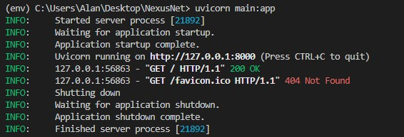
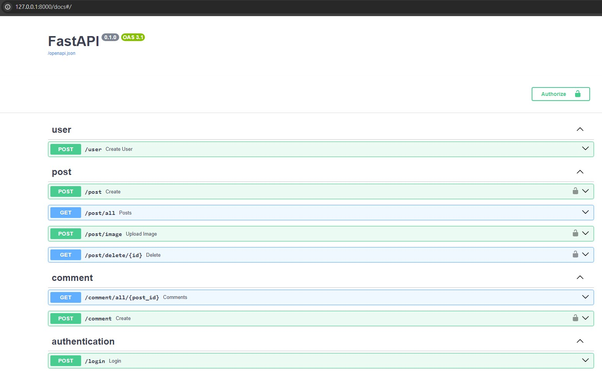
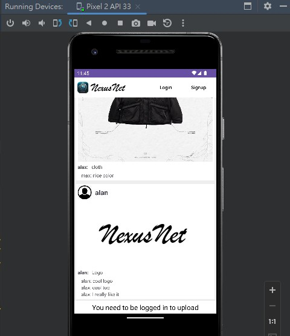
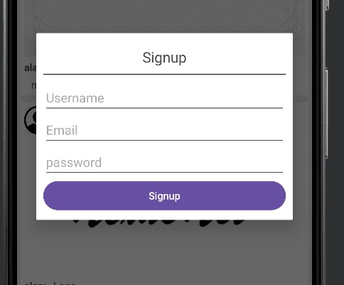
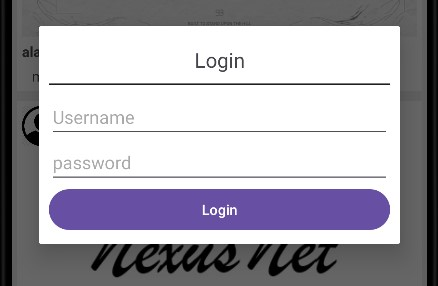
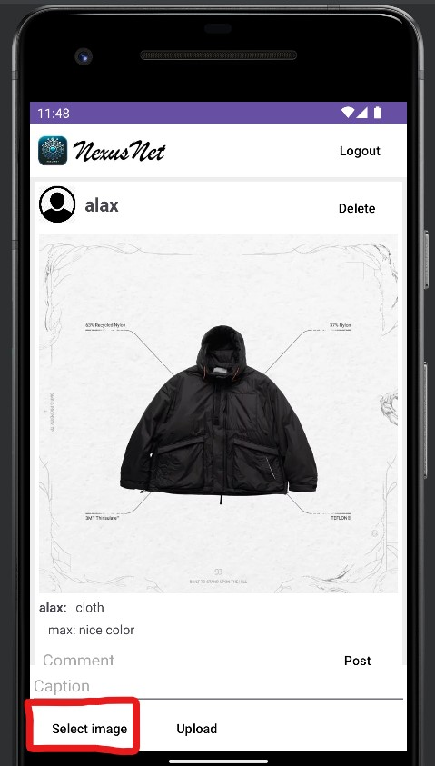
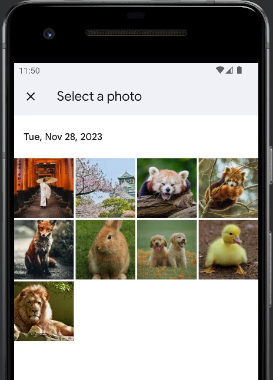
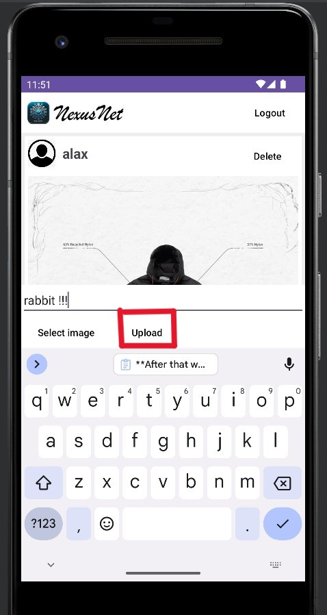
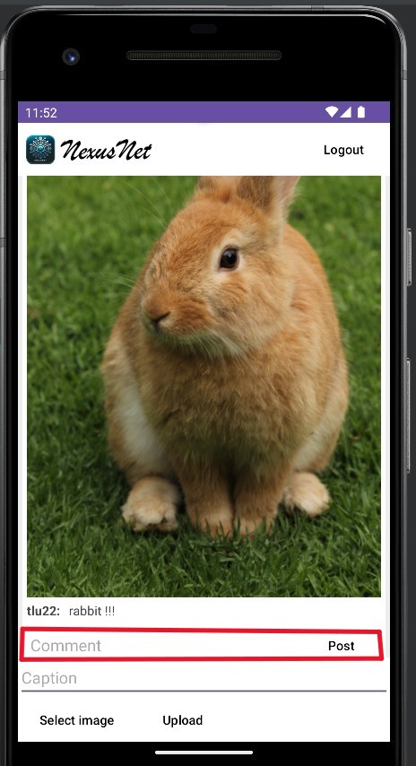

# NexusNetClone_vscode
Within the NexusNet_clone development environment in Visual Studio Code (VSCode), the magic begins with our meticulously crafted code for setting up the localhost and database. 
This code provides developers with a robust foundation, enabling seamless testing, debugging, and manipulation of data. 
With the localhost facilitating real-time coding exploration and the integrated database ensuring data reliability, our development process is both efficient and dynamic. 

# Environmnet Setup(FastAPI)

**In this part, we created a backend using FastAPI. After that we can get into our localhost**

`uvicorn main:app`

#### you can also set your portal num

`uvicorn main:app --reload --port 8005`

# Android Application

**In this Android App, there are multiple functions to do it such as Signup, Login, Logoout, posting, and comment**

### --Home page--

### --Signup page--

### --Login page--

### --After Login, you can select picture and post it--

### --Also, you can make a comment--
